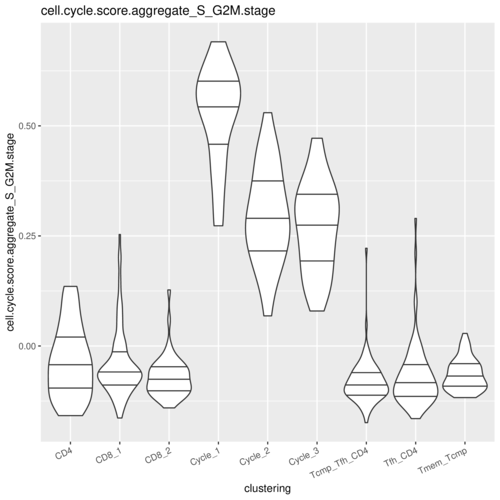
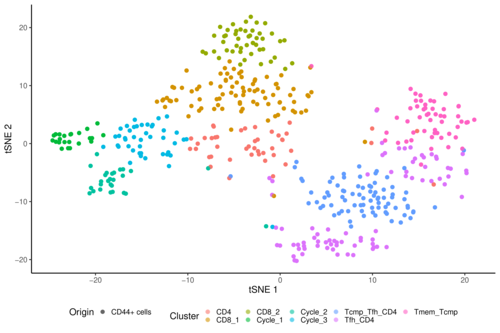
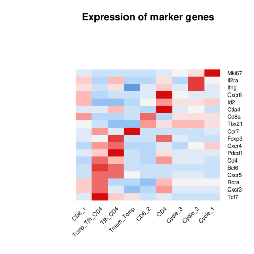
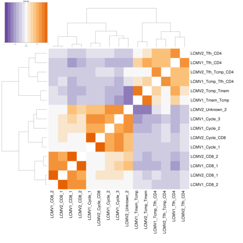
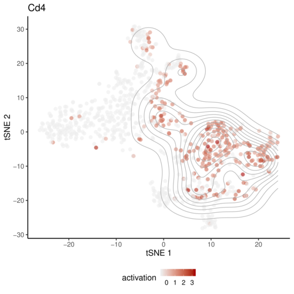
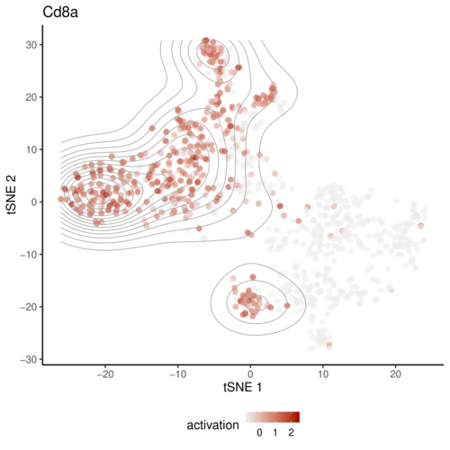

robustSingleCell
================

<!--[](https://cran.r-project.org/package=robustSingleCell)-->

[](https://travis-ci.org/asmagen/robustSingleCell)

### Overview

robustSingleCell is a pipeline designed to identify robust cell
subpopulations using scRNAseq data and compare population compositions
across tissues and experimental models via similarity analysis as
described in Magen et al. (2019)
[*bioRxiv*](https://doi.org/10.1101/543199) \[1\].

### Installation

Install the following dependencies before installing the package:

``` r
if(!require(devtools))
  install.packages("devtools")
if (!requireNamespace("BiocManager", quietly = TRUE))
  install.packages("BiocManager")

BiocManager::install("limma")
BiocManager::install("grimbough/biomaRt")
```

You can then install the stable version from CRAN:

``` r
install.packages("robustSingleCell")
```

To access the latest features or bug fixes, you can install the
development version from GitHub.

``` r
devtools::install_github("asmagen/robustsinglecell")
```

This pipeline currently supports [slurm](https://slurm.schedmd.com) for
parallel batch jobs.

### Getting help

If you encounter a clear bug, please submit an
[issue](https://github.com/asmagen/robustSingleCell/issues) with
reproducible example.

### Tutorial

We used two replicates of CD44<sup>+</sup> T cell data sets from Ciucci
et al. 2019 \[2\] as an example to demonstrate the use of
`robustSingleCell`. The analysis requires at least 8G of memory on
*slurm* \[3\] high performance computing workload manager (for example,
you can start by requesting `srun --pty -p <partition> --mem=8G
-t 1:00:00 bash` to start an interactive session).

We first download the raw 10X data from GEO using `GEOquery`, which can
be obtained using the following command if not already installed:

``` r
source("https://bioconductor.org/biocLite.R")
biocLite("GEOquery")
```

The two datasets `LCMV1`, `LCMV2` will be downloaded into TMPDIR. Each
folder will contain the `matrix.mtx`, `gene.tsv`, `barcode.tsv` files as
in 10X genomics format.

``` r
library(robustSingleCell)
download_LCMV()
```

We cluster each dataset separately to account for dataset-specific
technical and biological differences. Then, we measure the
transcriptional similarity and divergence between the clusters
identified in the two datasets using correlation analysis.

## Individual analysis of LCMV1 and LCMV2

First, we set up the directory where the results of the analysis will be
stored.

``` r
LCMV1 <- initialize.project(datasets = "LCMV1", 
                          origins = "CD44+ cells",
                          experiments = "Rep1",
                          data.path = file.path(tempdir(), "LCMV"),
                          work.path = file.path(tempdir(), "LCMV/LCMV_analysis"))
```

`read.data` function reads the data in 10X genomics format and performs
quality filtering as described in *Magen et al 2019*. We randomly
downsampled the datasets to 1000 cells to shorten the simplify this
example.

``` r
LCMV1 <- read.data(LCMV1, subsample = 500)
```

Next, we identify highly variable genes for the following PCA and
clustering analyses. We also compute the activation of gene sets of
interest, such as cell cycle genes, for confounder correction.

``` r
LCMV1 <- get.variable.genes(LCMV1) 
exhaustion_markers <- c('Pdcd1', 'Cd244', 'Havcr2', 'Ctla4', 'Cd160', 'Lag3', 'Tigit', 'Cd96')
LCMV1 <- add.confounder.variables(LCMV1,
    ribosomal.score = ribosomal.score(LCMV1),
    mitochondrial.score = mitochondrial.score(LCMV1),
    cell.cycle.score = cell.cycle.score(LCMV1),
    Exhaustion = controlled.mean.score(LCMV1, exhaustion_markers))
```

Figure 1 shows the mitochondrial score versus number of UMIs, pre and
post filtering.

<figure>


<figcaption>

Fig 1. Mitochondrial genes score vs. number of UMIs for pre (top) and
post (bottom) quality control filtering.

</figcaption>

</figure>

The `PCA` function performs multiple simulation analyses of shuffled
data to determine the appropriate number of PCs. You can also run each
simulation in parallel using the option `local = F`.

``` r
LCMV1 <- PCA(LCMV1, local = T)
```

We then perform clustering analysis for a range of clustering
resolutions. The analysis is repeated multiple times over shuffled data
to estimate the appropriate clustering resolution and control for false
discovery of clusters. At the end of the clustering, the function will
prompt you to choose an optimal clustering resolution. We choose 0.05
for our KNN ratio, which is the smallest value tested with
`mdlrty/mean.shfl` \> 2.

``` r
LCMV1 <- cluster.analysis(LCMV1, local = T)
```

<figure>


<figcaption>

Fig 2. Bar plot shows the clustering modularity of the original data
versus shuffled data across multiple clustering resolutions. Numbers on
top represent the fold change of original versus shuffled analysis for
each resolution.

</figcaption>

</figure>

We select the appropriate resolution, typically the one where there is
more than two (2) fold change modularity difference relative to the
shuffled analysis.

The `summarize` function which performs differential expression
analysis, computes tSNE and visualizes the results in the analysis
folder. After differential expression analysis, `get.cluster.names`
assigns clusters with names using a customized set of marker genes which
users should adapt to their own data.

``` r
types = rbind(
                data.frame(type='Tfh',gene=c('Tcf7','Cxcr5','Bcl6')),
                data.frame(type='Th1',gene=c('Cxcr6','Ifng','Tbx21')),
                data.frame(type='Tcmp',gene=c('Ccr7','Bcl2','Tcf7')),
                data.frame(type='Treg',gene=c('Foxp3','Il2ra')),
                data.frame(type='Tmem',gene=c('Il7r','Ccr7')),
                data.frame(type='CD8',gene=c('Cd8a')),
                data.frame(type='CD4', gene = c("Cd4")),
                data.frame(type='Cycle',gene=c('Mki67','Top2a','Birc5'))
)
summarize(LCMV1, local = T)
LCMV1_cluster_names <- get.cluster.names(LCMV1, types, min.fold = 1.0, max.Qval = 0.01)
LCMV1 <- set.cluster.names(LCMV1, names = LCMV1_cluster_names)
summarize(LCMV1, local = T)
```

Figure 3 shows violin plots indicating the activation of the cell cycle
genes.

<figure>



<figcaption>

Fig 3. Violin plot pf cell cycle score.

</figcaption>

</figure>

Figure 4 places individual cells on a two dimensional grid corresponding
to the scores of the first two PCs (note that the PCA figures are
created in the next step via `summarize` function below).

<figure>


<figcaption>

Fig 4. Single cells placement on a 2D grid corresponding to the first
two PCs.

</figcaption>

</figure>

The genes driving the PCs are visualized in figure 5 according to the
PCA loadings after removing the lowly ranked genes.

<figure>


<figcaption>

Fig 5. Top ranked genes contribution to PC1 and PC2 scores.

</figcaption>

</figure>

The average expression of genes driving the PCs can be visualized as a
heatmap visualized in figure 6 according to the PCA loadings after
removing the lowly ranked genes.

<figure>


<figcaption>

Fig 6. Heatmap shows loadings of the first PC.

</figcaption>

</figure>

Figure 7 shows the tSNE visualization of the cells, color coded by
cluster assignment.

<figure>



<figcaption>

Fig 7. t-SNE plot colored by cluster assignment.

</figcaption>

</figure>

We can also visualize the average expression of selected T cells marker
genes for initial evaluation (Figure 8).

``` r
canonical_genes <- c("Cd8a", "Cd4", "Mki67", "Foxp3", "Il2ra", "Bcl6",
                     "Cxcr5", "Cxcr6", "Ifng", "Tbx21", "Id2", "Rora",
                     "Cxcr3", "Tcf7", "Ccr7", "Cxcr4", "Pdcd1", "Ctla4")
plot_simple_heatmap(LCMV1, name = "canonical", markers = canonical_genes, main = "Expression of marker genes")
```

<figure>



<figcaption>

Fig 8. Heatmap shows row-normalized average expression of selected
marker genes per cluster.

</figcaption>

</figure>

We repeat the same procedure for `LCMV2` dataset.

``` r
LCMV2 <- initialize.project(datasets = "LCMV2",
                          origins = "CD44+ cells",
                          experiments = "Rep2",
                          data.path = file.path(tempdir(), "LCMV"),
                          work.path = file.path(tempdir(), "LCMV/LCMV_analysis"))
LCMV2 <- read.data(LCMV2, subsample = 500)
LCMV2 <- get.variable.genes(LCMV2)
LCMV2 <- add.confounder.variables(
  LCMV2, 
  ribosomal.score = ribosomal.score(LCMV2),
  mitochondrial.score = mitochondrial.score(LCMV2),
  cell.cycle.score = cell.cycle.score(LCMV2),
  Exhaustion = controlled.mean.score(LCMV2, exhaustion_markers))

LCMV2 <- PCA(LCMV2, local = T)
LCMV2 <- cluster.analysis(LCMV2, local = T)
summarize(LCMV2, local = T)
LCMV2_cluster_names <- get.cluster.names(LCMV2, types, min.fold = 1.0, max.Qval = 0.01)
LCMV2 <- set.cluster.names(LCMV2, names = LCMV2_cluster_names)
summarize(LCMV2, local = T)
plot_simple_heatmap(LCMV2, name = "canonical", markers = canonical_genes, main = "Expression of marker genes")
```

## Dataset Integration by Correlation Analysis

We then initialize the aggregate analysis of the two independent runs,
providing the information of which analyses folders should be used to
pull the data for integration.

``` r
pooled_env <- initialize.project(datasets = c("LCMV1", "LCMV2"),
                          origins = c("CD44+ cells", "CD44+ cells"),
                          experiments = c("Rep1", "Rep2"),
                          data.path = file.path(tempdir(), "LCMV"),
                          work.path = file.path(tempdir(), "LCMV/LCMV_analysis"))
pooled_env <- read.preclustered.datasets(pooled_env)
pooled_env <- add.confounder.variables(
  pooled_env, 
  ribosomal.score = ribosomal.score(pooled_env),
  mitochondrial.score = mitochondrial.score(pooled_env),
  cell.cycle.score = cell.cycle.score(pooled_env),
  Exhaustion = controlled.mean.score(pooled_env, exhaustion_markers))
pooled_env <- PCA(pooled_env, clear.previously.calculated.clustering = F, local = T)
summarize(pooled_env, contrast = "datasets", local = T)
```

We assessed the similarity between pairs of clusters and identify
reproducible subpopulations across the two replicates. Figure 9 shows
the correlation between clusters’ FC vectors across replicates (as
described in *Magen et al 2019*).

``` r
cluster.similarity <- assess.cluster.similarity(pooled_env)
similarity <- cluster.similarity$similarity
map <- cluster.similarity$map
filtered.similarity <- get.robust.cluster.similarity(
  pooled_env, similarity, min.sd = qnorm(.9), max.q.val = 0.01, rerun = F
  )
robust.clusters <- sort(unique(c(filtered.similarity$cluster1,
                                 filtered.similarity$cluster2)))
visualize.cluster.cors.heatmaps(pooled_env, pooled_env$work.path,
                                filtered.similarity)
```

<figure>


<figcaption>

Fig 9. Correlation between clusters’ FC vectors across the two
replicates.

</figcaption>

</figure>

Finally, the cluster similarity between all clusters integrated by this
analysis is shown in Figure 10. Unlike the simplified example shown
here, this analysis is typically used for estimating subpopulation
similarity and divergence across multiple tissue-origins or experimental
settings, including corresponding pre-clinical to clinical datasets as
described in *Magen et al 2019*.

``` r
similarity <- filtered.similarity
visualize.cluster.similarity.stats(pooled_env, similarity)
```

<figure>



<figcaption>

Fig 10. Correlation among all the clusters in the two datasets.

</figcaption>

</figure>

## Identification and visualization of robust novel marker genes

``` r
differential.expression.statistics = get.robust.markers(
   pooled_env, cluster_group1 = c('LCMV2_Tfh_CD4', 'LCMV2_Tfh_Tcmp_CD4'),
   cluster_group2 = c('LCMV2_CD8_1', 'LCMV2_CD8_2'),
   group1_label = 'CD4 T Cells', group2_label = 'CD8 T Cells')
```

<figure>


<figcaption>

Fig 11. Scatter plot indicating gene activation across two independent
groups of cells. X and Y axis values annotate fractions of cells
expressing (\>0 UMIs) each gene.

</figcaption>

</figure>

Using the expression statistics output and the figure (generated to
‘robust.diff.exp.pdf’) you may identify genes showing exclusive
expression in one (or more) selected population (cluster\_group1) versus
the others (cluster\_group2). We can annotate the tSNE with the
expression level of selected genes or draw contour plots resembling Flow
Cytometric analysis.

``` r
plot_contour_overlay_tSNE(pooled_env, genes = c('Cd4','Cd8a'))
```

<figure>




<figcaption>

Fig 12. tSNE overlay with contour annotation of normalized expression
level of CD4 and CD8a.

</figcaption>

</figure>

``` r
plot_pair_scatter(pooled_env, gene1 = 'Cd4', gene2 = 'Cd8a',
   cluster_group1 = c('LCMV2_Tfh_CD4', 'LCMV2_Tfh_Tcmp_CD4'),
   cluster_group2 = c('LCMV2_CD8_1','LCMV2_CD8_2'),
   group1_label = 'CD4 T Cells', group2_label = 'CD8 T Cells')
```

<figure>


<figcaption>

Fig 13. Contours of CD4 vs CD8 normalized expression level.

</figcaption>

</figure>

1.  Magen *et al*. “Single-cell profiling of tumor-reactive
    CD4<sup>+</sup> T-cells reveals unexpected transcriptomic diversity”
    [*bioRxiv 543199*](https://doi.org/10.1101/543199)

2.  Ciucci, Thomas, et al. “The Emergence and Functional Fitness of
    Memory CD4+ T Cells Require the Transcription Factor Thpok.”
    *Immunity* 50.1 (2019): 91-105.

3.  [slurm](https://slurm.schedmd.com)
